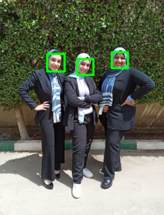

# Computer Vision SBE404B

# Assignment_5 "Face recognetion"

#####

| Submitted by:            | Sec. | B.N. | E-mail                      |
| ------------------------ | ---- | ---- | --------------------------- |
| Ashar Seif el Nasr Saleh | 1    | 9    | asharzanqour@gmail.com      |
| Alaa Allah Essam Abdrabo | 1    | 13   | alaaessammirah@gmail.com    |
| Razan Salah El-sayed     | 1    | 32   | razansalah022@gmail.com     |
| Sohila Mohamed Maher     | 1    | 38   | sohilamohamed583@gmail.com  |
| Mariam Ashraf Mohamed    | 2    | 24   | mariamashraf731@outlook.com |

# 1. Code Architecture

# 1.1 Dataset

# 1.2 Face detection
```python
    """
    Detect faces in given image using xml cascades file which contains OpenCV data used to detect objects
    - loads the face cascade into memory
    :return: faces list which contains a lists of:
        - x, y location and width, height of each detected face
    """
    src = np.copy(source)
    cascade_path = r"src\haarcascade_frontalface_default.xml"

    face_cascade = cv2.CascadeClassifier(cascade_path)

    # Detect faces in the image
    faces = face_cascade.detectMultiScale(
        image=src,
        scaleFactor=scale_factor,
        minNeighbors=5,
        minSize=(min_size, min_size),
        flags=cv2.CASCADE_SCALE_IMAGE
    )
    # Draw a rectangle around the faces
    for (x, y, w, h) in faces:
        cv2.rectangle(img=src, pt1=(x, y), pt2=(x + w, y + h),
                      color=(0, 255, 0), thickness=thickness)
```

# 1.3 Eigen faces

# 1.4 Projection on the eigen vectors

# 1.5 Compare similarity

# 1.6 performance matrices

1. Get confusion Matrix

2. Calculate the performance matrices

# 1.7 Roc curve

1. Workin on to lists: actual and prediction propbabilities
2. Make list of thresholds from range 0.0 to 1

```python
thresholds = np.array(list(range(0, 100, 1)))/100
```

3. loop on thresholds andCalculate predected class [0,1] according to threshold and loop on prediction list

```python
if predicted[i] >= threshold:
    predClass = 1
else:
    predClass = 0
```

4. Calculate confusion Matrix
5. Get TPRate and FPRate

```python
TPrate = tp/(tp+fn)
FPRate = fp/(tn+fp)
```

6. Get ROC points and draw the curve

# Results

# 1.2 Face detection
 

# Discussion

-
-

-
-
